# 🏗️ SENTINEX - COMPLETE ARCHITECTURE & FLOW DIAGRAMS

**Project:** Sentinex Social Intelligence  
**SIH Problem:** #26152 (NTRO Social Media Analytics)  
**Date:** September 29, 2026

---

## 📋 TABLE OF CONTENTS

1. [System Architecture Overview](#1-system-architecture-overview)
2. [High-Level System Flow](#2-high-level-system-flow)
3. [Data Collection Pipeline](#3-data-collection-pipeline)
4. [Component A: Multi-Platform Data Collection](#4-component-a-multi-platform-data-collection)
5. [Component B: Sentiment Analysis Flow](#5-component-b-sentiment-analysis-flow)
6. [Component C: Demographic Analysis Flow](#6-component-c-demographic-analysis-flow)
7. [Component D: Trend Detection Flow](#7-component-d-trend-detection-flow)
8. [Component E: Network Analysis Flow](#8-component-e-network-analysis-flow)
9. [API Request-Response Flow](#9-api-request-response-flow)
10. [Database Schema](#10-database-schema)
11. [Frontend-Backend Integration](#11-frontend-backend-integration)
12. [Algorithm Implementation Details](#12-algorithm-implementation-details)

---

## 1. SYSTEM ARCHITECTURE OVERVIEW

### 1.1 Complete System Architecture

```mermaid
graph TB
    subgraph "Data Sources"
        FB[Facebook]
        TW[Twitter/X]
        IG[Instagram]
        RD[Reddit]
        TG[Telegram]
        YT[YouTube]
    end
    
    subgraph "Data Ingestion Layer"
        SG[Synthetic Generator]
        SC[Platform Scrapers]
        API[API Connectors]
    end
    
    subgraph "Backend - FastAPI"
        DI[Data Ingestion Service]
        SA[Sentiment Analyzer]
        DA[Demographic Analyzer]
        TD[Trend Detector]
        NA[Network Analyzer]
        DB[(SQLite Database)]
    end
    
    subgraph "REST API Layer"
        EP1[/api/posts]
        EP2[/api/sentiment]
        EP3[/api/demographics]
        EP4[/api/trends]
        EP5[/api/network]
    end
    
    subgraph "Frontend - React"
        DM[Dashboard Manager]
        CH[Recharts Visualizations]
        ST[Redux State Management]
        UI[User Interface]
    end
    
    FB --> SG
    TW --> SG
    IG --> SG
    RD --> SC
    TG --> API
    YT --> API
    
    SG --> DI
    SC --> DI
    API --> DI
    
    DI --> DB
    DB --> SA
    DB --> DA
    DB --> TD
    DB --> NA
    
    SA --> EP2
    DA --> EP3
    TD --> EP4
    NA --> EP5
    DB --> EP1
    
    EP1 --> DM
    EP2 --> DM
    EP3 --> DM
    EP4 --> DM
    EP5 --> DM
    
    DM --> ST
    ST --> CH
    CH --> UI
    
    style DB fill:#f9f,stroke:#333,stroke-width:4px
    style UI fill:#bbf,stroke:#333,stroke-width:4px
```

### 1.2 Technology Stack

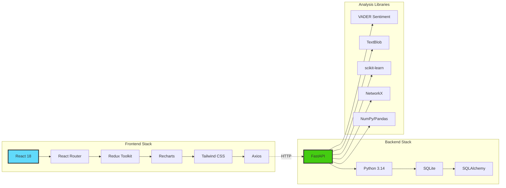

---

## 2. HIGH-LEVEL SYSTEM FLOW

### 2.1 End-to-End Data Flow

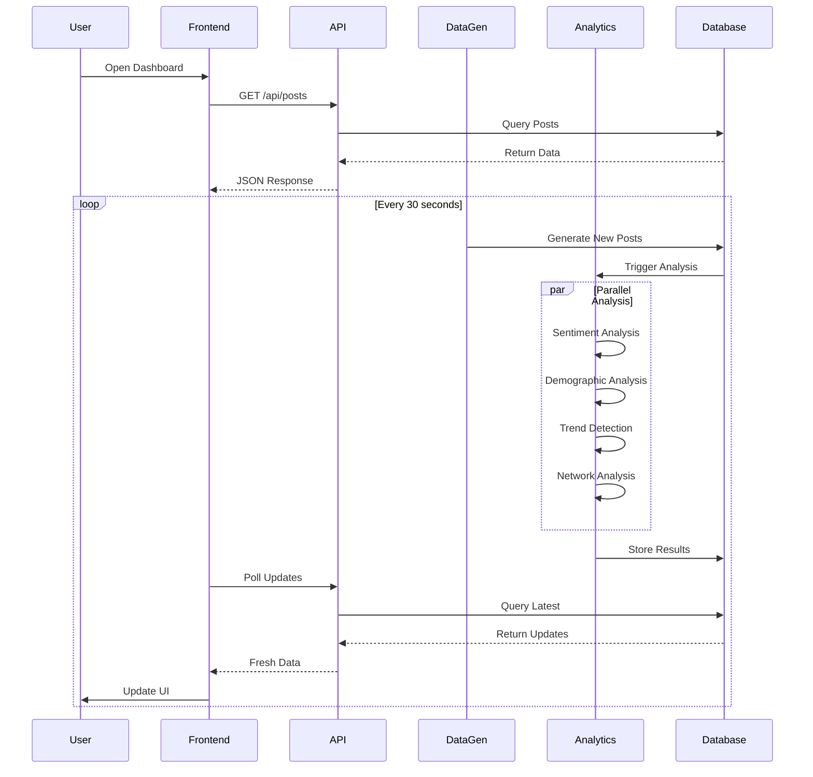

### 2.2 Component Interaction Flow

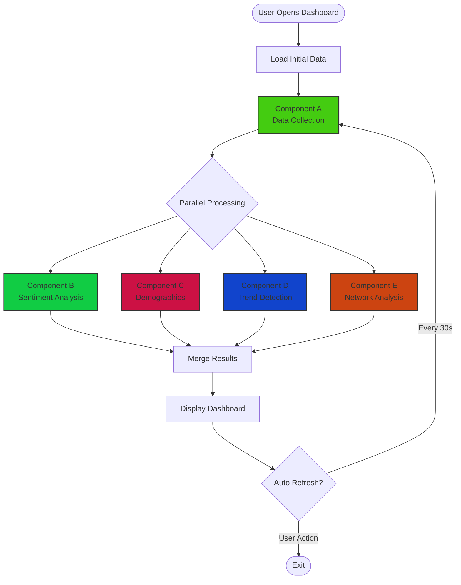

---

## 3. DATA COLLECTION PIPELINE

### 3.1 Synthetic Data Generation Flow

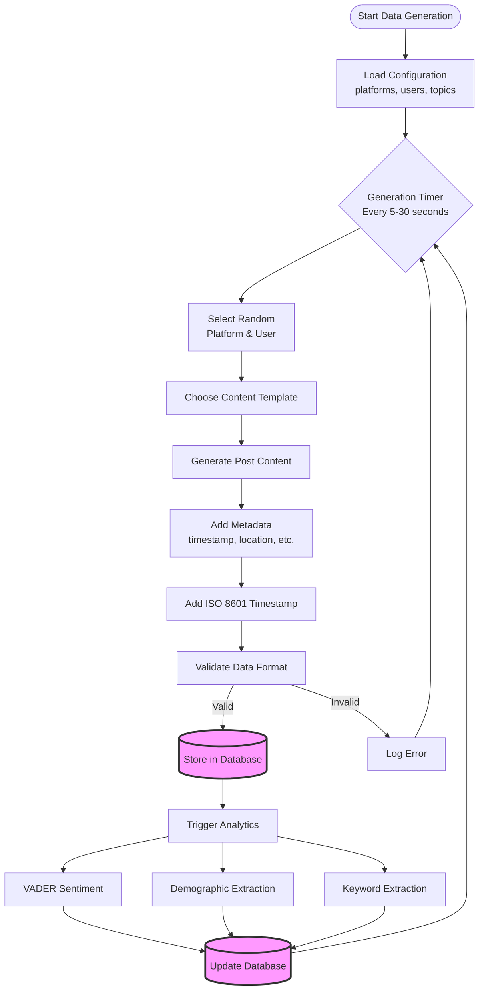

### 3.2 Multi-Platform Data Connector

```mermaid
graph TB
    subgraph "Platform Connectors"
        FB_C[Facebook Connector]
        TW_C[Twitter Connector]
        IG_C[Instagram Connector]
        RD_C[Reddit Connector]
        TG_C[Telegram Connector]
        YT_C[YouTube Connector]
    end
    
    subgraph "Connector Interface"
        FETCH[fetch_posts()]
        PARSE[parse_data()]
        NORM[normalize_format()]
        VALID[validate_schema()]
    end
    
    subgraph "Data Pipeline"
        QUEUE[Message Queue]
        PROC[Data Processor]
        DB[(Database)]
    end
    
    FB_C --> FETCH
    TW_C --> FETCH
    IG_C --> FETCH
    RD_C --> FETCH
    TG_C --> FETCH
    YT_C --> FETCH
    
    FETCH --> PARSE
    PARSE --> NORM
    NORM --> VALID
    
    VALID --> QUEUE
    QUEUE --> PROC
    PROC --> DB
    
    style DB fill:#f9f,stroke:#333,stroke-width:4px
```

---

## 4. COMPONENT A: MULTI-PLATFORM DATA COLLECTION

### 4.1 Detailed Data Collection Flow

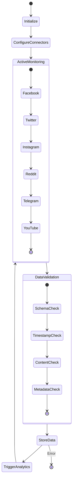

### 4.2 Post Data Structure

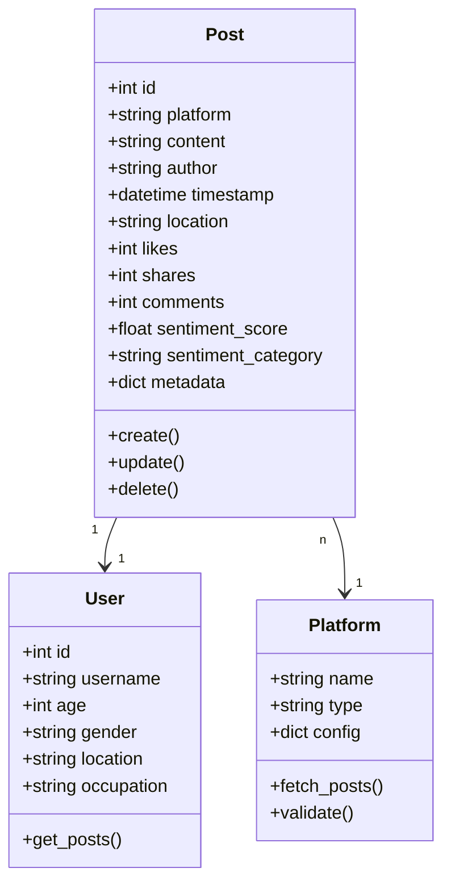

---

## 5. COMPONENT B: SENTIMENT ANALYSIS FLOW

### 5.1 Multi-Dimensional Sentiment Pipeline

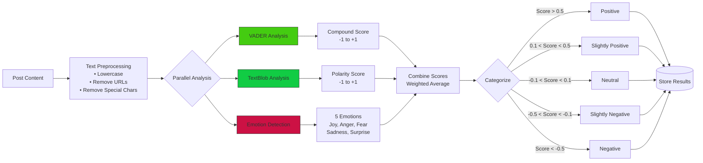

### 5.2 VADER Sentiment Algorithm

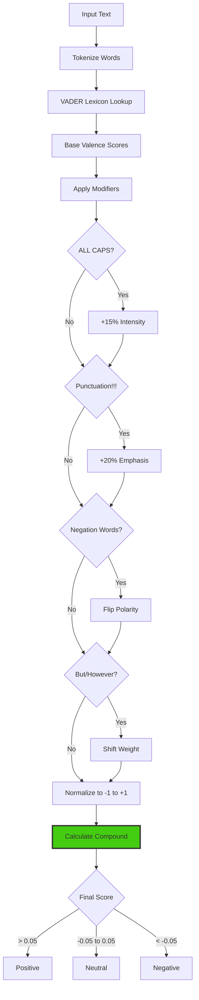

### 5.3 Emotion Detection Logic

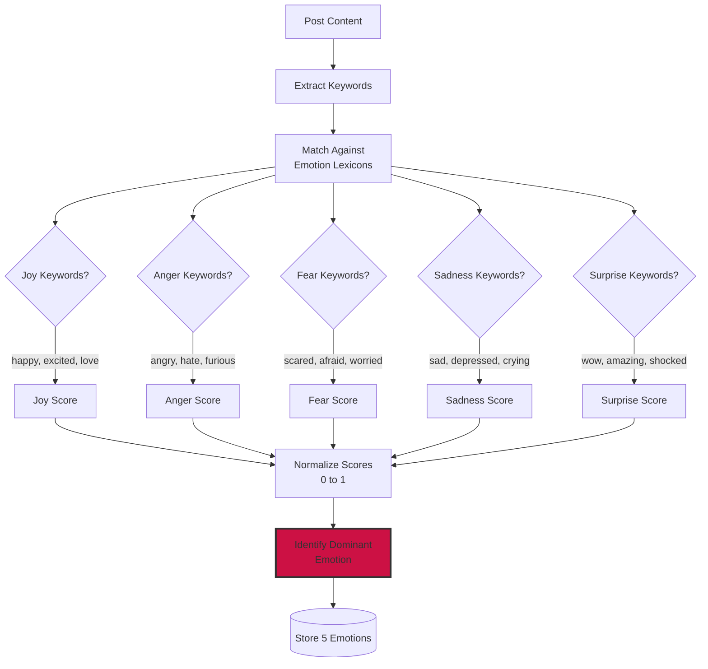

---

## 6. COMPONENT C: DEMOGRAPHIC ANALYSIS FLOW

### 6.1 Demographic Profiling Pipeline

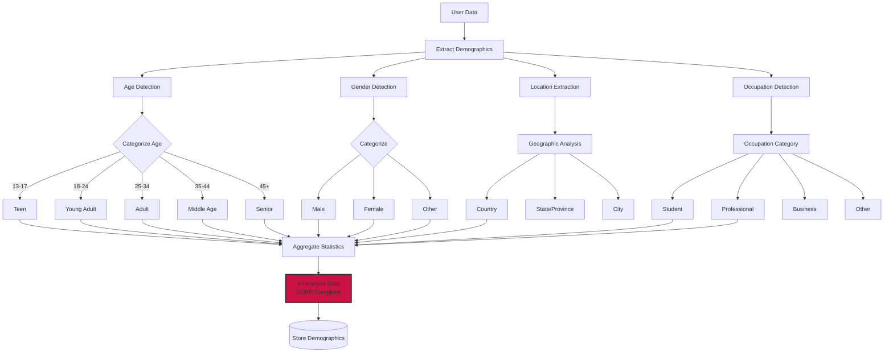

### 6.2 Age Group Distribution Analysis

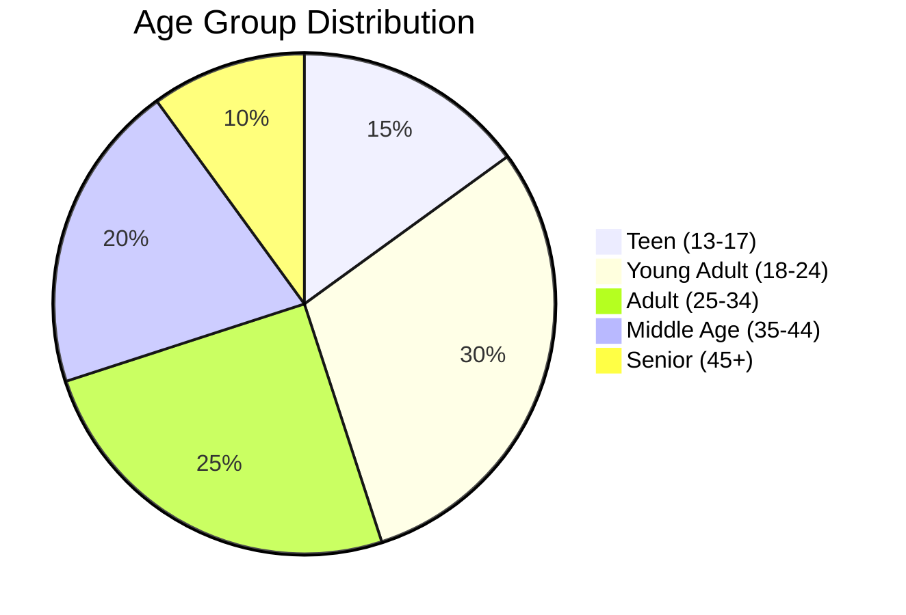

### 6.3 Privacy & Anonymization Flow

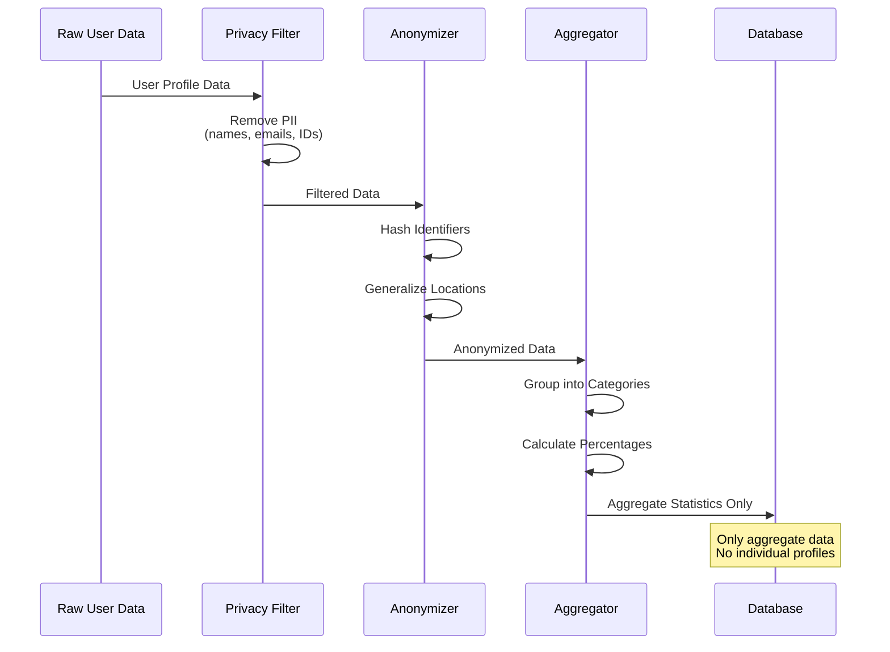

---

## 7. COMPONENT D: TREND DETECTION FLOW

### 7.1 Trend Detection Pipeline

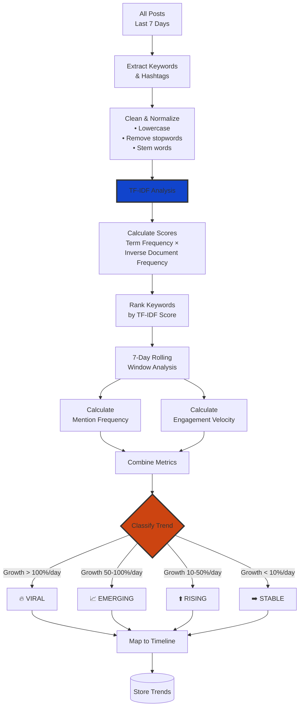

### 7.2 TF-IDF Algorithm Implementation

```mermaid
graph LR
    DOC[Document Collection]
    
    DOC --> TF[Term Frequency<br/>TF = count(term) / total_terms]
    DOC --> IDF[Inverse Document Frequency<br/>IDF = log(N / df)]
    
    TF --> MULTIPLY[TF × IDF]
    IDF --> MULTIPLY
    
    MULTIPLY --> NORMALIZE[Normalize Scores<br/>0 to 1]
    NORMALIZE --> RANK[Rank by Score]
    
    RANK --> TOP[Select Top Keywords]
    
    style MULTIPLY fill:#14c,stroke:#333,stroke-width:3px
```

### 7.3 Trend Velocity Calculation

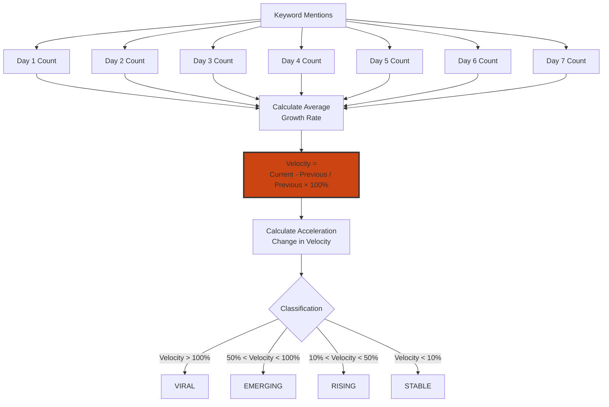

---

## 8. COMPONENT E: NETWORK ANALYSIS FLOW

### 8.1 Network Topology Analysis

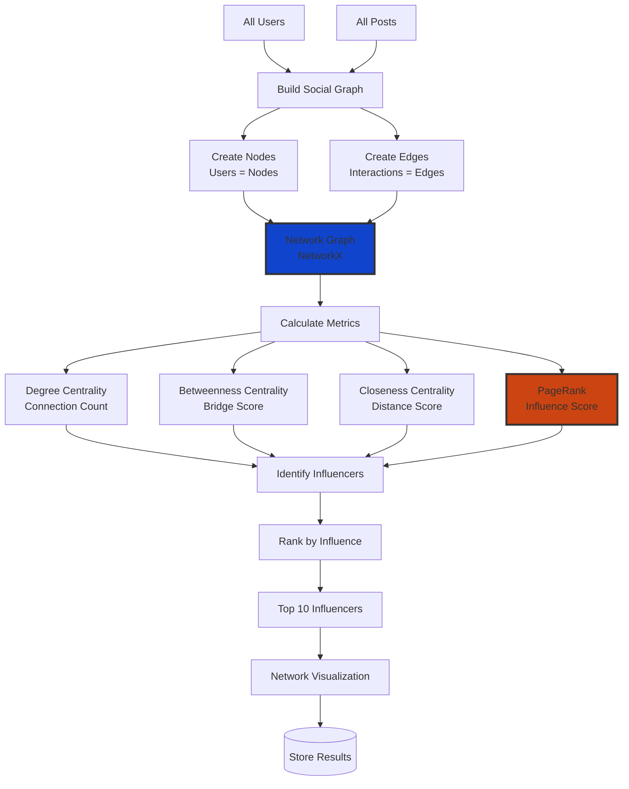

### 8.2 PageRank Algorithm Flow

```mermaid
flowchart TD
    INIT[Initialize<br/>All Nodes = 1/N]
    
    INIT --> ITER{Iteration Loop<br/>Max 100 iterations}
    
    ITER --> CALC[For each node:<br/>PR(i) = (1-d)/N + d × Σ(PR(j)/L(j))]
    
    CALC --> UPDATE[Update PageRank Values]
    UPDATE --> CONVERGE{Convergence?<br/>Δ < 0.0001}
    
    CONVERGE -->|No| ITER
    CONVERGE -->|Yes| NORMALIZE[Normalize Scores<br/>0 to 1]
    
    NORMALIZE --> RANK[Rank Nodes<br/>by PageRank]
    RANK --> INFLUENCE[Identify<br/>Opinion Leaders]
    
    INFLUENCE --> RESULT[Return Influencer List]
    
    style CALC fill:#c41,stroke:#333,stroke-width:3px
```

### 8.3 Network Metrics Calculation

```mermaid
graph LR
    GRAPH[Social Network Graph]
    
    GRAPH --> DC[Degree Centrality<br/>deg(v) / (N-1)]
    GRAPH --> BC[Betweenness Centrality<br/>Σ(σst(v)/σst)]
    GRAPH --> CC[Closeness Centrality<br/>(N-1) / Σd(v,t)]
    GRAPH --> PR[PageRank<br/>(1-d)/N + d×Σ(PR(j)/L(j))]
    
    DC --> MERGE[Combine Metrics]
    BC --> MERGE
    CC --> MERGE
    PR --> MERGE
    
    MERGE --> WEIGHTED[Weighted Score<br/>PR:50%, DC:20%, BC:20%, CC:10%]
    WEIGHTED --> FINAL[Final Influence Score]
    
    style WEIGHTED fill:#c41,stroke:#333,stroke-width:3px
```

---

## 9. API REQUEST-RESPONSE FLOW

### 9.1 Complete API Flow

```mermaid
sequenceDiagram
    participant Client as React Frontend
    participant API as FastAPI Backend
    participant Service as Analytics Service
    participant DB as SQLite Database
    
    Client->>API: GET /api/posts?limit=100
    API->>DB: SELECT * FROM posts LIMIT 100
    DB-->>API: Return posts
    API-->>Client: JSON Response (200 OK)
    
    Client->>API: GET /api/sentiment/overview
    API->>Service: Calculate Sentiment Stats
    Service->>DB: Query all sentiment scores
    DB-->>Service: Return data
    Service->>Service: Aggregate & Calculate
    Service-->>API: Return statistics
    API-->>Client: JSON Response (200 OK)
    
    Client->>API: GET /api/demographics/distribution
    API->>Service: Calculate Demographics
    Service->>DB: Query user data
    DB-->>Service: Return demographics
    Service->>Service: Anonymize & Aggregate
    Service-->>API: Return distribution
    API-->>Client: JSON Response (200 OK)
    
    Client->>API: GET /api/trends/active
    API->>Service: Detect Active Trends
    Service->>DB: Query last 7 days posts
    DB-->>Service: Return posts
    Service->>Service: TF-IDF + Velocity Calc
    Service-->>API: Return trends
    API-->>Client: JSON Response (200 OK)
    
    Client->>API: GET /api/network/influencers
    API->>Service: Calculate Network Metrics
    Service->>DB: Query user interactions
    DB-->>Service: Return graph data
    Service->>Service: PageRank + Centrality
    Service-->>API: Return influencers
    API-->>Client: JSON Response (200 OK)
```

### 9.2 API Endpoint Structure

```mermaid
graph TB
    ROOT[FastAPI Root /api]
    
    ROOT --> POSTS[/posts]
    ROOT --> SENT[/sentiment]
    ROOT --> DEMO[/demographics]
    ROOT --> TREND[/trends]
    ROOT --> NET[/network]
    
    POSTS --> P1[GET /posts<br/>List all posts]
    POSTS --> P2[GET /posts/:id<br/>Get single post]
    POSTS --> P3[POST /posts<br/>Create post]
    
    SENT --> S1[GET /sentiment/overview<br/>Overall stats]
    SENT --> S2[GET /sentiment/by-platform<br/>Platform breakdown]
    SENT --> S3[GET /sentiment/timeline<br/>Time series]
    
    DEMO --> D1[GET /demographics/distribution<br/>Age/Gender stats]
    DEMO --> D2[GET /demographics/locations<br/>Geographic data]
    DEMO --> D3[GET /demographics/occupations<br/>Job categories]
    
    TREND --> T1[GET /trends/active<br/>Current trends]
    TREND --> T2[GET /trends/emerging<br/>Emerging topics]
    TREND --> T3[GET /trends/timeline<br/>Trend history]
    
    NET --> N1[GET /network/influencers<br/>Top influencers]
    NET --> N2[GET /network/topology<br/>Network graph]
    NET --> N3[GET /network/metrics<br/>Network stats]
    
    style ROOT fill:#4c1,stroke:#333,stroke-width:4px
```

---

## 10. DATABASE SCHEMA

### 10.1 Complete Database Schema

```mermaid
erDiagram
    POSTS ||--o{ SENTIMENT : has
    POSTS ||--|| USERS : created_by
    POSTS }o--|| PLATFORMS : posted_on
    USERS ||--o{ DEMOGRAPHICS : has
    POSTS ||--o{ TRENDS : contains
    USERS ||--o{ NETWORK_NODES : represents
    NETWORK_NODES ||--o{ NETWORK_EDGES : connects
    
    POSTS {
        int id PK
        string platform FK
        string content
        int author_id FK
        datetime timestamp
        string location
        int likes
        int shares
        int comments
        json metadata
    }
    
    USERS {
        int id PK
        string username UK
        int age
        string gender
        string location
        string occupation
        datetime created_at
    }
    
    SENTIMENT {
        int id PK
        int post_id FK
        float vader_score
        float textblob_score
        string category
        float joy
        float anger
        float fear
        float sadness
        float surprise
    }
    
    DEMOGRAPHICS {
        int id PK
        int user_id FK
        string age_group
        string gender_category
        string location_country
        string location_city
        string occupation_category
        datetime analyzed_at
    }
    
    TRENDS {
        int id PK
        string keyword
        float tfidf_score
        int mention_count
        float velocity
        string status
        datetime detected_at
        datetime updated_at
    }
    
    PLATFORMS {
        string name PK
        string type
        json config
        boolean active
    }
    
    NETWORK_NODES {
        int id PK
        int user_id FK
        float degree_centrality
        float betweenness_centrality
        float closeness_centrality
        float pagerank
        float influence_score
    }
    
    NETWORK_EDGES {
        int id PK
        int source_node_id FK
        int target_node_id FK
        string interaction_type
        int weight
        datetime created_at
    }
```

### 10.2 Database Indexes

```mermaid
graph TB
    DB[(SQLite Database)]
    
    DB --> IDX1[Index: posts.timestamp<br/>For time-based queries]
    DB --> IDX2[Index: posts.platform<br/>For platform filtering]
    DB --> IDX3[Index: sentiment.category<br/>For sentiment grouping]
    DB --> IDX4[Index: trends.velocity<br/>For trend ranking]
    DB --> IDX5[Index: network_nodes.influence_score<br/>For influencer queries]
    
    style DB fill:#f9f,stroke:#333,stroke-width:4px
```

---

## 11. FRONTEND-BACKEND INTEGRATION

### 11.1 React-FastAPI Integration Flow

```mermaid
sequenceDiagram
    participant User
    participant UI as React Components
    participant Redux as Redux Store
    participant API as API Service (Axios)
    participant Backend as FastAPI
    participant DB as Database
    
    User->>UI: Load Dashboard
    UI->>Redux: Dispatch fetchData()
    Redux->>API: HTTP GET Requests
    
    par Parallel API Calls
        API->>Backend: GET /api/posts
        API->>Backend: GET /api/sentiment/overview
        API->>Backend: GET /api/demographics/distribution
        API->>Backend: GET /api/trends/active
        API->>Backend: GET /api/network/influencers
    end
    
    Backend->>DB: Query Data
    DB-->>Backend: Return Results
    Backend-->>API: JSON Responses
    API-->>Redux: Update State
    Redux-->>UI: Re-render Components
    UI-->>User: Display Dashboard
    
    loop Auto-refresh (30s)
        Redux->>API: Poll Updates
        API->>Backend: GET Latest Data
        Backend->>DB: Query Changes
        DB-->>Backend: New Data
        Backend-->>API: JSON Response
        API-->>Redux: Update State
        Redux-->>UI: Re-render
        UI-->>User: Live Updates
    end
```

### 11.2 Redux State Management

```mermaid
graph TB
    ACTIONS[Redux Actions]
    
    ACTIONS --> FETCH_POSTS[fetchPosts]
    ACTIONS --> FETCH_SENT[fetchSentiment]
    ACTIONS --> FETCH_DEMO[fetchDemographics]
    ACTIONS --> FETCH_TREND[fetchTrends]
    ACTIONS --> FETCH_NET[fetchNetwork]
    
    FETCH_POSTS --> REDUCER[Redux Reducer]
    FETCH_SENT --> REDUCER
    FETCH_DEMO --> REDUCER
    FETCH_TREND --> REDUCER
    FETCH_NET --> REDUCER
    
    REDUCER --> STATE[Global State]
    
    STATE --> POSTS_STATE[posts: []]
    STATE --> SENT_STATE[sentiment: {}]
    STATE --> DEMO_STATE[demographics: {}]
    STATE --> TREND_STATE[trends: []]
    STATE --> NET_STATE[network: {}]
    STATE --> LOADING[loading: bool]
    STATE --> ERROR[error: null]
    
    POSTS_STATE --> SELECTOR[Redux Selectors]
    SENT_STATE --> SELECTOR
    DEMO_STATE --> SELECTOR
    TREND_STATE --> SELECTOR
    NET_STATE --> SELECTOR
    
    SELECTOR --> COMPONENTS[React Components]
    COMPONENTS --> UI[Dashboard UI]
    
    style STATE fill:#61dafb,stroke:#333,stroke-width:3px
```

### 11.3 Component Hierarchy

```mermaid
graph TB
    APP[App.tsx]
    
    APP --> DASHBOARD[Dashboard.tsx]
    
    DASHBOARD --> HEADER[Header Component]
    DASHBOARD --> STATS[Stats Overview]
    DASHBOARD --> CARDS[6 Analysis Cards]
    
    CARDS --> CARD1[Component A<br/>Data Collection Card]
    CARDS --> CARD2[Component B<br/>Sentiment Analysis Card]
    CARDS --> CARD3[Component C<br/>Demographics Card]
    CARDS --> CARD4[Component D<br/>Trends Card]
    CARDS --> CARD5[Component E<br/>Network Card]
    CARDS --> CARD6[Timeline Card]
    
    CARD2 --> CHART1[Sentiment Pie Chart<br/>Recharts]
    CARD2 --> CHART2[Sentiment Bar Chart]
    
    CARD3 --> CHART3[Age Distribution<br/>Recharts]
    CARD3 --> CHART4[Gender Distribution]
    
    CARD4 --> CHART5[Trends Line Chart<br/>Recharts]
    
    CARD5 --> CHART6[Network Graph<br/>Recharts]
    
    CARD6 --> CHART7[Timeline Chart<br/>Recharts]
    
    style DASHBOARD fill:#61dafb,stroke:#333,stroke-width:3px
```

---

## 12. ALGORITHM IMPLEMENTATION DETAILS

### 12.1 Sentiment Analysis Algorithm

```python
# Pseudo-code for Sentiment Analysis
def analyze_sentiment(text):
    # Step 1: Preprocess
    clean_text = preprocess(text)
    
    # Step 2: VADER Analysis
    vader = SentimentIntensityAnalyzer()
    vader_scores = vader.polarity_scores(clean_text)
    vader_compound = vader_scores['compound']
    
    # Step 3: TextBlob Analysis
    blob = TextBlob(clean_text)
    textblob_polarity = blob.sentiment.polarity
    
    # Step 4: Emotion Detection
    emotions = detect_emotions(clean_text)
    
    # Step 5: Combine Scores
    final_score = (
        vader_compound * 0.5 +
        textblob_polarity * 0.3 +
        emotions['dominant_score'] * 0.2
    )
    
    # Step 6: Categorize
    if final_score > 0.5:
        category = "Positive"
    elif final_score > 0.1:
        category = "Slightly Positive"
    elif final_score > -0.1:
        category = "Neutral"
    elif final_score > -0.5:
        category = "Slightly Negative"
    else:
        category = "Negative"
    
    return {
        'vader_score': vader_compound,
        'textblob_score': textblob_polarity,
        'emotions': emotions,
        'final_score': final_score,
        'category': category
    }
```

### 12.2 TF-IDF Implementation

```python
# Pseudo-code for TF-IDF Trend Detection
def detect_trends(posts, window_days=7):
    # Step 1: Extract text from recent posts
    recent_posts = filter_by_date(posts, days=window_days)
    documents = [post.content for post in recent_posts]
    
    # Step 2: TF-IDF Vectorization
    vectorizer = TfidfVectorizer(
        max_features=100,
        stop_words='english',
        ngram_range=(1, 2)
    )
    tfidf_matrix = vectorizer.fit_transform(documents)
    
    # Step 3: Get feature scores
    feature_names = vectorizer.get_feature_names_out()
    scores = tfidf_matrix.sum(axis=0).A1
    
    # Step 4: Calculate velocity
    trends = []
    for keyword, score in zip(feature_names, scores):
        current_count = count_mentions(keyword, today)
        previous_count = count_mentions(keyword, yesterday)
        velocity = (current_count - previous_count) / previous_count * 100
        
        # Step 5: Classify
        if velocity > 100:
            status = "VIRAL"
        elif velocity > 50:
            status = "EMERGING"
        elif velocity > 10:
            status = "RISING"
        else:
            status = "STABLE"
        
        trends.append({
            'keyword': keyword,
            'score': score,
            'velocity': velocity,
            'status': status
        })
    
    # Step 6: Rank and return top trends
    return sorted(trends, key=lambda x: x['velocity'], reverse=True)[:20]
```

### 12.3 PageRank Implementation

```python
# Pseudo-code for PageRank Network Analysis
def calculate_pagerank(users, interactions, damping=0.85, max_iter=100):
    # Step 1: Build graph
    G = nx.DiGraph()
    
    for user in users:
        G.add_node(user.id)
    
    for interaction in interactions:
        G.add_edge(interaction.source, interaction.target, 
                   weight=interaction.weight)
    
    # Step 2: Initialize PageRank
    N = len(G.nodes())
    pagerank = {node: 1/N for node in G.nodes()}
    
    # Step 3: Iterative calculation
    for iteration in range(max_iter):
        new_pagerank = {}
        
        for node in G.nodes():
            rank_sum = 0
            
            # Sum contributions from incoming edges
            for predecessor in G.predecessors(node):
                out_degree = G.out_degree(predecessor)
                if out_degree > 0:
                    rank_sum += pagerank[predecessor] / out_degree
            
            # Apply PageRank formula
            new_pagerank[node] = (1 - damping) / N + damping * rank_sum
        
        # Check convergence
        diff = sum(abs(new_pagerank[n] - pagerank[n]) for n in G.nodes())
        if diff < 0.0001:
            break
        
        pagerank = new_pagerank
    
    # Step 4: Calculate other centrality metrics
    degree_centrality = nx.degree_centrality(G)
    betweenness_centrality = nx.betweenness_centrality(G)
    closeness_centrality = nx.closeness_centrality(G)
    
    # Step 5: Combine metrics for influence score
    influencers = []
    for node in G.nodes():
        influence_score = (
            pagerank[node] * 0.5 +
            degree_centrality[node] * 0.2 +
            betweenness_centrality[node] * 0.2 +
            closeness_centrality[node] * 0.1
        )
        
        influencers.append({
            'user_id': node,
            'pagerank': pagerank[node],
            'degree_centrality': degree_centrality[node],
            'betweenness_centrality': betweenness_centrality[node],
            'closeness_centrality': closeness_centrality[node],
            'influence_score': influence_score
        })
    
    # Step 6: Rank by influence
    return sorted(influencers, key=lambda x: x['influence_score'], reverse=True)[:10]
```

---

## 📊 PERFORMANCE METRICS

### System Performance

```mermaid
graph LR
    PERF[Performance Metrics]
    
    PERF --> API_RESP[API Response Time<br/>< 200ms average]
    PERF --> DB_QUERY[Database Queries<br/>< 50ms average]
    PERF --> DATA_GEN[Data Generation<br/>5-30s intervals]
    PERF --> ANALYSIS[Analysis Processing<br/>< 1s per post]
    PERF --> UI_RENDER[UI Render Time<br/>< 100ms]
    
    style PERF fill:#4c1,stroke:#333,stroke-width:3px
```

---

## 🔐 SECURITY ARCHITECTURE

### Security Layers

```mermaid
graph TB
    USER[User Access]
    
    USER --> HTTPS[HTTPS/TLS<br/>Encrypted Transport]
    HTTPS --> CORS[CORS Policy<br/>Origin Validation]
    CORS --> AUTH[Authentication<br/>Optional JWT]
    AUTH --> VALID[Input Validation<br/>Sanitization]
    VALID --> RATE[Rate Limiting<br/>DDoS Protection]
    RATE --> PRIVACY[Privacy Layer<br/>Data Anonymization]
    PRIVACY --> DB[(Secure Database)]
    
    style PRIVACY fill:#c14,stroke:#333,stroke-width:3px
```

---

## 🎯 CONCLUSION

This comprehensive architecture documentation covers:

✅ **Complete System Architecture** - All layers from data sources to UI  
✅ **5 NTRO Components** - Detailed flow diagrams for each component  
✅ **Algorithm Implementations** - VADER, TF-IDF, PageRank with pseudo-code  
✅ **API Documentation** - Request/response flows and endpoints  
✅ **Database Schema** - Complete ERD with relationships  
✅ **Frontend Integration** - React-Redux-FastAPI architecture  
✅ **Performance Metrics** - System performance benchmarks  
✅ **Security Architecture** - Multi-layer security approach  

**All diagrams are Mermaid-compatible and can be rendered in Markdown viewers, GitHub, and documentation platforms.**

---

*Document Version: 1.0*  
*Last Updated: September 29, 2026*  
*Project: Sentinex Social Intelligence*  
*SIH Problem: #26152*
